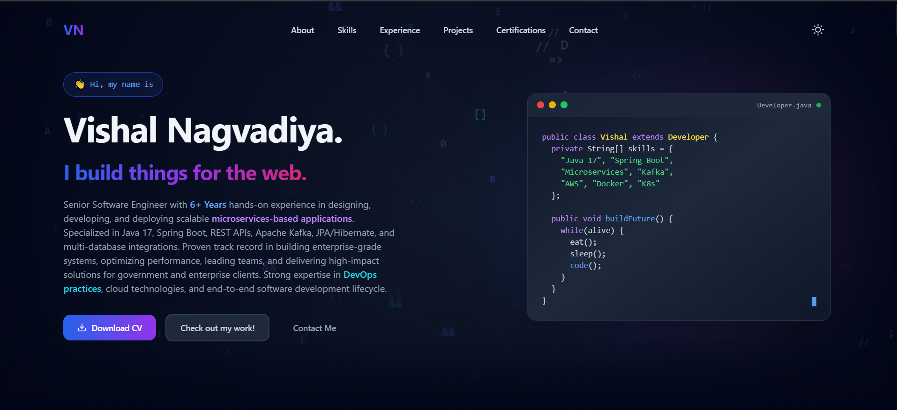
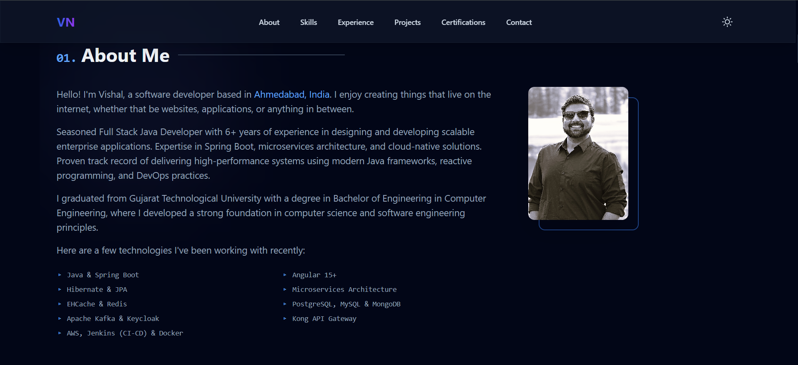
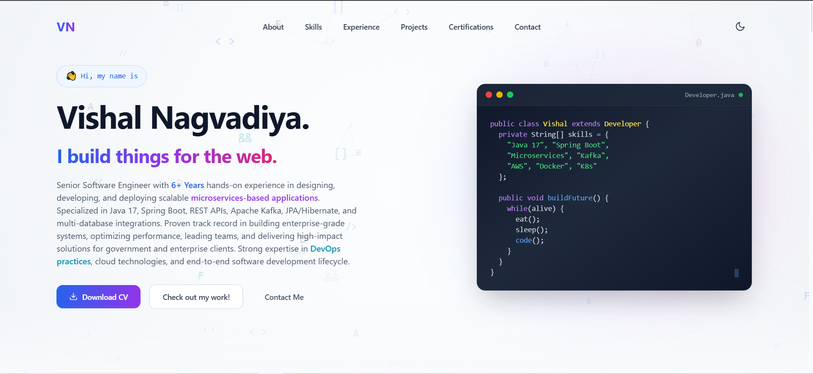
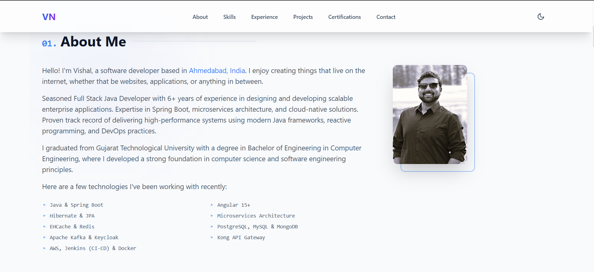

# Vishal Nagvadiya - Portfolio

A modern, responsive portfolio website built with Next.js 14, TypeScript, and Tailwind CSS, showcasing my work as a Senior Java Developer.



## ✨ Features

- 🎨 **Modern Design** - Clean, professional interface with dark/light mode
- 📱 **Fully Responsive** - Optimized for all devices
- ⚡ **Fast Performance** - Built with Next.js 14 for optimal speed
- 🎭 **Smooth Animations** - Powered by Framer Motion
- 🔍 **SEO Optimized** - Meta tags and structured data
- 🐳 **Docker Ready** - Easy deployment with Docker & Nginx
- � **HTTPS Support** - Automatic SSL with Let's Encrypt

## 🖼️ Screenshots

### Dark Mode



### Light Mode



## 🚀 Quick Start

### Prerequisites

- Node.js 18.x or higher
- npm or yarn

### Installation

```bash
# Clone the repository
git clone https://github.com/Vpn97/java-dev-portfolio.git
cd java-dev-portfolio

# Install dependencies
npm install

# Run development server
npm run dev
```

Open [http://localhost:3000](http://localhost:3000) in your browser.

## 📝 Customization

### Update Your Information

Edit `data/portfolio.json` with your details:

```json
{
  "personal": {
    "name": "Your Name",
    "role": "Your Role",
    "email": "your.email@example.com",
    "summary": "Your professional summary..."
  }
}
```

### Add Your Resume

Place your CV/resume PDF in the `public` folder and name it `cv.pdf`.

## 🌐 Deployment

### Option 1: Deploy with Docker (Recommended for Production)

Perfect for deploying on **Amazon EC2**, **DigitalOcean**, or any **Linux server**.

#### Requirements
- Linux server (Ubuntu 20.04+)
- Docker and Docker Compose
- Domain name pointing to your server
- Ports 80 and 443 open

#### Quick Deploy

```bash
# On your Linux server
git clone https://github.com/Vpn97/java-dev-portfolio.git
cd java-dev-portfolio

# Run deployment script
chmod +x deploy.sh
./deploy.sh

# Choose option 1 for production with SSL
# Enter your domain and email
```

The script will:
- ✅ Install Docker & Docker Compose (if needed)
- ✅ Set up SSL certificate (Let's Encrypt)
- ✅ Configure Nginx reverse proxy
- ✅ Start your application with HTTPS

#### Update Production Deployment

```bash
# Pull latest changes
git pull origin main

# Run deployment script
./deploy.sh

# Choose option 4: Update existing production deployment
```

#### Manual Docker Deployment

```bash
# Build and start services
docker-compose up -d --build

# View logs
docker-compose logs -f

# Stop services
docker-compose down
```

### Option 2: Deploy without Docker

#### Deploy to Vercel (Easiest)

1. Push your code to GitHub
2. Visit [vercel.com](https://vercel.com)
3. Click "New Project"
4. Import your GitHub repository
5. Deploy!

Your site will be live at `https://your-project.vercel.app`

#### Deploy to Netlify

```bash
# Install Netlify CLI
npm install -g netlify-cli

# Build the project
npm run build

# Deploy
netlify deploy --prod
```

#### Deploy to GitHub Pages

1. Update `next.config.mjs`:
```javascript
const nextConfig = {
  output: "export",
  basePath: "/java-dev-portfolio",
  images: { unoptimized: true },
};
```

2. Build and deploy:
```bash
npm run build
# Push the `out` folder to gh-pages branch
```

## 🐳 Docker Configuration

The project includes:
- **Dockerfile** - Multi-stage build for optimized images
- **docker-compose.yml** - Orchestrates Next.js, Nginx, and Certbot
- **Nginx** - Reverse proxy with SSL/TLS
- **Certbot** - Automatic SSL certificate management

### Docker Services

| Service | Purpose | Port |
|---------|---------|------|
| nextjs | Next.js application | 3000 (internal) |
| nginx | Reverse proxy & SSL | 80, 443 |
| certbot | SSL certificate management | - |

## 🛠️ Built With

- [Next.js 14](https://nextjs.org/) - React framework
- [TypeScript](https://www.typescriptlang.org/) - Type safety
- [Tailwind CSS](https://tailwindcss.com/) - Styling
- [Framer Motion](https://www.framer.com/motion/) - Animations
- [React Icons](https://react-icons.github.io/react-icons/) - Icons
- [Docker](https://www.docker.com/) - Containerization
- [Nginx](https://nginx.org/) - Web server

## 📦 Available Scripts

```bash
npm run dev      # Start development server
npm run build    # Build for production
npm start        # Start production server
npm run lint     # Run ESLint
```

## 🔒 Security Features

- HTTPS enforced (HTTP redirects to HTTPS)
- Modern TLS 1.2/1.3 only
- Security headers (HSTS, X-Frame-Options, CSP)
- Rate limiting for DDoS protection
- Non-root Docker containers

## 📊 Performance

- Optimized Docker images (multi-stage builds)
- Nginx caching for static assets
- Gzip compression
- HTTP/2 support
- Image optimization

## 🤝 Contributing

Feel free to fork this project and customize it for your own portfolio!

## 📄 License

This project is open source and available under the [MIT License](LICENSE).

## 📧 Contact

**Vishal Nagvadiya**

- Email: vpn0097@gmail.com
- GitHub: [@Vpn97](https://github.com/Vpn97)
- LinkedIn: [Vishal Nagvadiya](https://www.linkedin.com/in/vishalnagvadiya)
- Portfolio: [vishal.apkzube.com](https://vishal.apkzube.com)

---

⭐ **Star this repo if you found it helpful!**

Built with ❤️ using Next.js, TypeScript, and Docker
